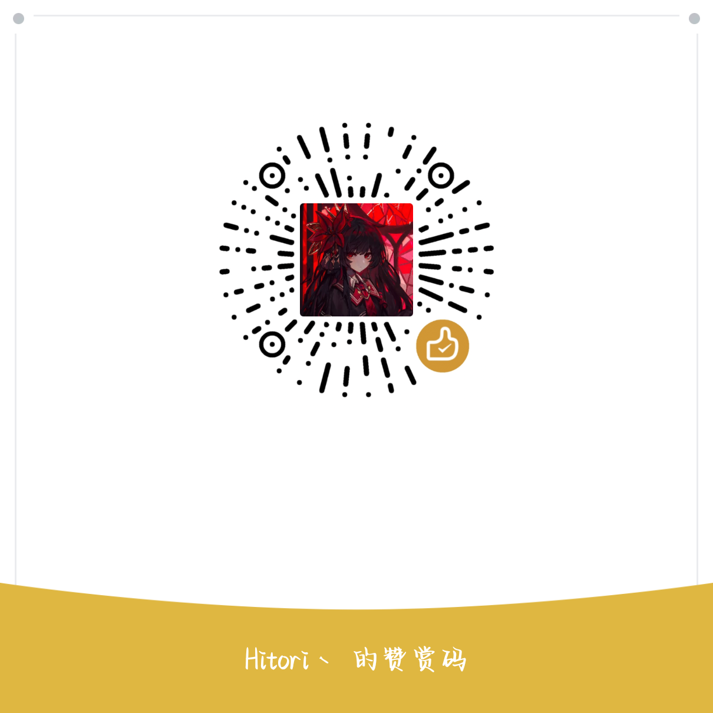

# OpenGalgame

OpenGalgame 是面向 Galgame、视觉小说和强剧情互动作品创作者的编辑器。

现功能为创建作品、整理角色和设定、编写剧本，把同一场景需要参考的内容和设定放在一起查看，本软件只允许个人、非商业用途免费使用。


## 下载

最新版安装包会放在 GitHub Releases。

当前 Windows x64 测试包文件名：

```text
OpenGalgame_0.2.0_x64-setup.exe
```

## 安装

1. 打开 GitHub Releases 页面，下载 `OpenGalgame_0.2.0_x64-setup.exe`。
2. 双击安装包，按安装向导完成安装。
3. 从开始菜单或桌面入口启动 OpenGalgame。

当前测试版仅提供 Windows x64 安装包。普通用户不需要额外安装开发环境。

第一版暂未进行代码签名。Windows 可能提示“未知发布者”或触发 SmartScreen 拦截。安装包来源确认是本项目 GitHub Releases 后，可以继续运行。

## 当前功能

- 创建和打开 galgame 剧本编辑器。
- 整理剧情需要的各种设定，在画布上操作。
- 在写某一场戏时，把相关人物、地点、设定和灵感等等放在同一工作区查看。
- 按卡片编辑正文。
- 记录临时素材想法，并在需要时整理为正式资料。
- 保留可回退记录，减少误改后回退不了。

## 功能说明

### 工作台界面

打开作品后，OpenGalgame 会进入导演工作台。左侧资料栏放剧情、角色、地点、设定和自定义资料；右侧是当前场景的工作区。当前写到哪一场、正在整理哪些资料、作品是否已经保存，都集中在这个界面里。

顶部的当前场景入口负责切换正在整理的场景。资料栏不把场景混在普通资料里，写资料和整理场景是两件事，界面上也分开处理。

### 常用快捷键

在工作台里，可以用快捷键处理最近几步操作和左侧资料栏里的资料资源。

| 快捷键 | 用途 |
| --- | --- |
| `Ctrl+Z` | 撤销上一步工作台操作。 |
| `Ctrl+Y` | 重做刚撤销的操作。 |
| `Ctrl+Shift+Z` | 重做刚撤销的操作。 |
| `Ctrl+X` | 剪切资料栏当前选中的资源。 |
| `Ctrl+C` | 复制资料栏当前选中的资源。 |
| `Ctrl+V` | 把已复制或剪切的资源粘贴到当前资料分类。 |
| `F2` | 重命名资料栏当前选中的资源。 |
| `删除` | 删除资料栏当前选中的资源，删除前会要求确认。 |
| `Ctrl+Shift+C` | 复制资料栏当前资源的项目相对路径。 |
| `Ctrl+K` 后再按 `Ctrl+Shift+C` | 复制资料栏当前资源在本机上的完整路径。 |
| `Shift+Alt+R` | 在 Windows 文件资源管理器中显示当前资源。 |
| `Ctrl+Shift+F` | 在当前资料分类内查找这个资源。 |

正在正文、命名弹窗或其他输入框里打字时，`Ctrl+Z`、`Ctrl+C`、`Ctrl+V` 等按键会先按文本编辑习惯处理，不会抢走你正在输入的内容。

### 正文卡片

剧情、角色、地点和设定都可以按卡片打开正文。新建资料时会带一个中文起始模板，比如角色资料会有基本信息、性格、背景、剧情作用等常用段落。模板只是起点，不是固定表格。

字段可以改名、删除，也可以自己增加。已经写好的内容会按普通文章保存，后面想直接查看、整理或迁移，也不会被工具锁在某种隐藏格式里。

### 场景桌

场景桌就是右侧那块画布。它能放资料卡、临时便签和当前场景里的关系线。一个角色、一段剧情、一个地点或一条设定，都可以放到画布上一起看。

画布上可以直接拖动卡片位置，调整前后关系；也可以新建便签，先记下一句想法，之后再整理成正式资料。卡片之间可以建立关系，并写下这条关系在当前场景里的含义，例如“她知道这个秘密，但还没有说出口”。

画布还保留整理视图和缩放定位这类动作。场景里资料多的时候，可以把分散的卡片收拢一下，方便重新看整体。

从画布上的卡片打开后，还能继续看正文页或联系页。正文页写资料本身，联系页看这张卡片在当前场景里和哪些资料有关。

### 联系页

正文卡片里有“正文”和“联系”两个页面。正文页写资料本身，联系页看这张卡片在当前场景里和哪些资料有关。

关系说明可以在联系页继续改；不再需要的关系也可以从这里删掉。删除关系不会删除角色、地点或剧情资料，只是移除当前场景里的这条联系。

### 版本记录

版本记录用来保留创作过程。写完一段、调整完一场戏，或者准备尝试大改之前，可以保存一个当前版本。

以后觉得改坏了，可以从保存记录里回到之前的状态。回档前会显示会受影响的文件，避免不清楚自己会改回哪里。

## 后续方向

OpenGalgame 后续会继续扩展为面向 Galgame 制作的创作工作台。

AI 会在后续版本加入，方向不是简单聊天，而是围绕作品内容提供辅助：协作剧本创作，设定创作，创作美术素材，推演分支，模拟玩家测试。

## 反馈问题

如果遇到问题，请在 GitHub Issues 提交反馈。

## 赞助支持

OpenGalgame 还在持续打磨中。如果这个工具帮你更顺手地整理设定、推进剧本和保护创作过程，可以自愿扫码赞助，支持后续开发、测试和发布维护。


